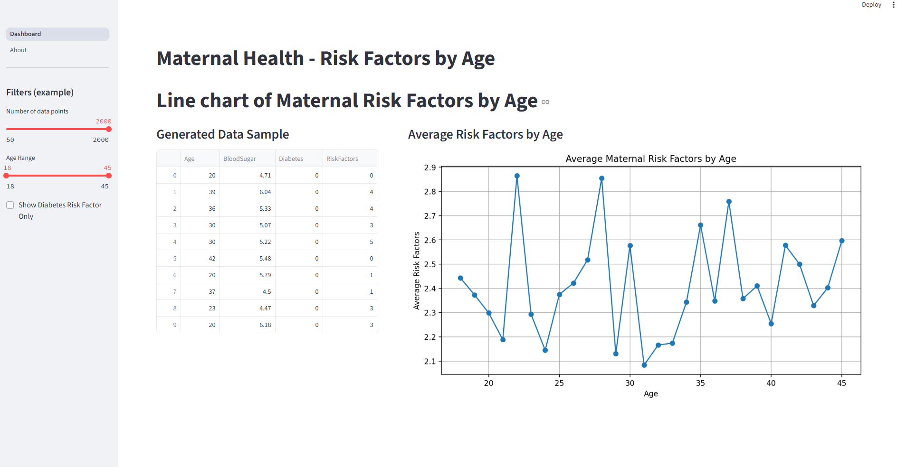
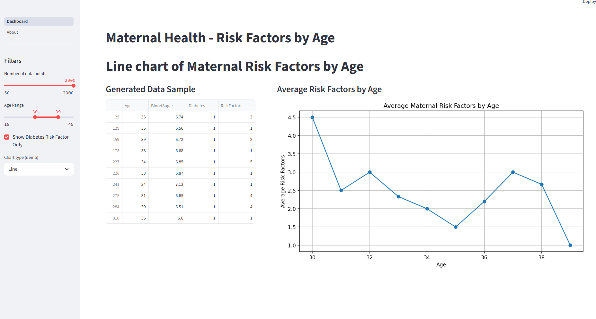
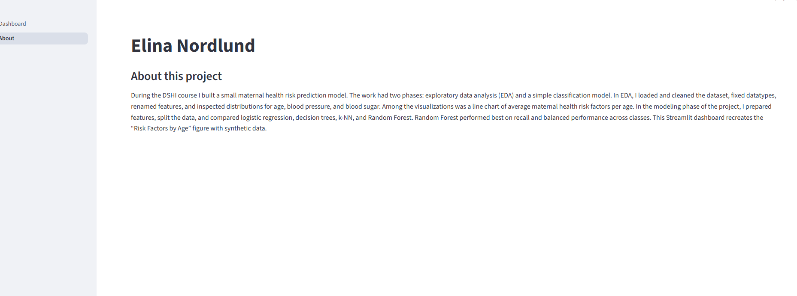

# PROHI Dashboard Example

**Author**: Elina Nordlund.
<!-- As main author, do not write anything in the line below.
The collaborator will edit the line below in GitHub -->
**Collaborator**: Meilia Chrisandra


## Introduction

This file contains a simple dashboard on maternal health risk factors. It is a line graph that shows avergare maternal health risks per age, for patients ages 18-45. The data was generated through numpy np.random. 

### Content
**Dashboard** Line graph showing average maternal risk factors per age (18-45 years old). Table showing the first 10 rows of data.
**About** Section that describes the context of the project.

### Widgets
The dashboard contains four widgets for user input - one slider for numbers of data points, one for age range, one checkbox for users who want to only view risk factors for patients with diabetes, and one drop down with option to view as a line or scatter graph.

### Screen shots
Below are three screenshots from the dashboard. The first one shows the linegraph containing data on all patients in the dataframe, while the second shows patients with diabetes aged 30-39. The last screenshot shows the About-section that describes the project.





## System description

### Installation of libraries

Run the commands below in a terminal to configure the project and install the package dependencies for the first time.

If you are using Mac, you may need to install Xcode. Check the official Streamlit documentation [here](https://docs.streamlit.io/get-started/installation/command-line#prerequisites).

1. Create the environment with `python -m venv env`
2. Activate the virtual environment for Python
   - [Linux/Mac] `source env/bin/activate` 
   - [Windows command prompt] `.\env\Scripts\activate.bat` 
   - [in Windows PowerShell] `.\env\Scripts\Activate.ps1`
3. Make sure that your terminal is in the environment (`env`) not in the global Python installation. The terminal should start with the word `env`
4. Install required packages `pip install -r ./requirements.txt`
5. Check that the installation works running `streamlit hello`
6. Stop the terminal by pressing **Ctrl+C**

### Execute custom Dashboard

First, make sure that you are running Python from the environment. Check the steps 2 and 3 above. Then, to run the custom dashboard execute the following command:

```
> streamlit run Dashboard.py
# If the command above fails, use:
> python -m streamlit run Dashboard.py
```

### Dependencies

Tested on Python 3.12.7 with the following packages:
  - Jupyter v1.1.1
  - Streamlit v1.46.1
  - Seaborn v0.13.2
  - Plotly v6.2.0
  - Scikit-Learn v1.7.0
  - shap v0.48.0

## Contributors

Elina Nordlund